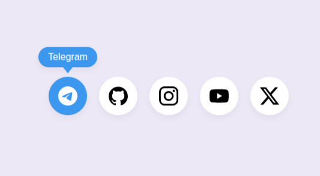

# 🎨 Social Hover Icons

A modern set of **animated social media icons** (Telegram, Instagram, YouTube, X/Twitter, GitHub) built with **pure HTML & CSS**.  
Each icon features **smooth hover animations** that enhance user experience while keeping the design lightweight and responsive.

---

## ✨ Features
- ⚡ 100% HTML & CSS (no JavaScript required)  
- 🎬 Smooth transitions and hover effects  
- 📱 Fully responsive (works on desktop & mobile)  
- 🖌 Easy to customize (colors, size, shape)  
- ♿ Accessible with `aria-label` support  

---

## 🔗 Live Demo
👉 [View on GitHub Pages](https://its-allen.github.io/social-hover-icons)  

---

## 🖼 Preview



---

## 🛠 Tech Stack
- **HTML5** – semantic structure  
- **CSS3** – flex/grid layout, transitions, transforms  

---

## 🚀 Getting Started
Clone this repository and open `index.html` in your browser:

```bash
git clone https://github.com/its-allen/social-hover-icons.git
cd social-hover-icons
